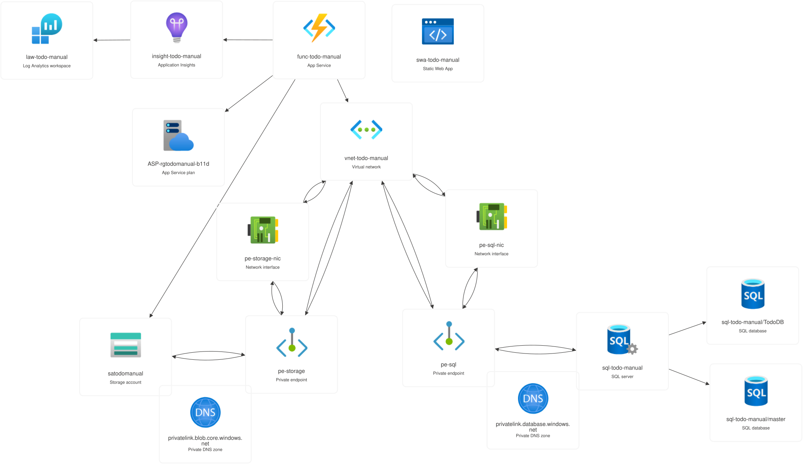

# Azure Todo App (Manual Setup Guide)

This branch contains the simplified version of the Todo App, designed to be deployed manually via the Azure Portal and CLI tools. It separates the frontend (Static Web App) and backend (Azure Functions + SQL Database).



---

## Prerequisites

Before starting, ensure you have the following installed on your local machine.

> [!TIP] **Windows Users:** For the best experience with the Azure CLI and shell commands used in this guide, it is highly recommended to install and use **Windows Subsystem for Linux (WSL)**. This allows you to run a native Linux environment (like Ubuntu) directly on Windows.
**Install:** Open PowerShell as Administrator and run `wsl --install`.

### 1. Azure CLI
Used to manage Azure resources from the command line.
- **Install:** [Install Azure CLI](https://learn.microsoft.com/en-us/cli/azure/install-azure-cli)
- **Verify:** Run `az --version`

### 2. Node.js & npm
Required for the Static Web Apps CLI and frontend tools.
- **Install:** [Download Node.js](https://nodejs.org/) (LTS version recommended)

### 3. Azure Functions Core Tools
Required to run and debug the Python function app locally.
- **Install (via npm):**
  ```bash
  npm install -g azure-functions-core-tools@4 --unsafe-perm true
  ```
- **Verify:** Run `func --version`

### 4. Azure Static Web Apps CLI (SWA CLI)
Used to serve and deploy the frontend manually.
- **Install (via npm):**
  ```bash
  npm install -g @azure/static-web-apps-cli
  ```
- **Verify:** Run `swa --version`

### 5. Python 3.10+
Required for the backend logic.
- **Install:** [Download Python](https://www.python.org/downloads/)

---

## Step 1: Create Azure Resources (Portal)

### 1.1 Resource Group
The container for all your application components.

* Subscription: *{your subscription}*
* Resource group name: `rg-todo-manual`
* Region: **East US 2** *(or your preferred region)*

### 1.2 Virtual Network
This provides the private network layer and connectivity for your app components.

* Basics:
	* Resource group: **rg-todo-manual**
	* Virtual network name: `vnet-todo-manual`
	* Region: **East US 2**
* IP addresses:
    * IPv4 address space: `10.0.0.0/16`
    * Subnets:
        1. *Outbound Subnet (for Functions):*
            * Name: `snet-outbound`
            * Starting address: `10.0.0.0`
            * Size: `/24`
            * Delegate subnet to a service: **Microsoft.App/environments**
        2. *Private Subnet (for Data):*
            * Name: `snet-private`
            * Starting address: `10.0.1.0`
            * Size: `/24`
            *  Enable private subnet: **checked**
  
### 1.3  SQL Database

* Resource group: **rg-todo-manual**
* Database  name: `TodoDB`
* Server: **Create new**
	* Server  name: `sql-todo-manual` *(must be globally unique)*
	* Location: **East US 2**
	* Authentication method: **Use both SQL and Microsoft Entra authentication**
	* Set Microsoft Entra admin: *{select your Entra user account}*
	* Server admin login: `sqladmin`
	* Password: `YourVeryStrongPassword123`
* Workload environment: **Development**
* Compute + storage: **General Purpose - Serverless**

### 1.4  Log Analytics Workspace

* Subscription: *{your subscription}*
* Resource group name: **rg-todo-manual**
* Name: `law-todo-manual`
* Region: **East US 2**

### 1.5 Function App

**Martketplace > Function App > Create Function App (Flex Consumption):**
* Basics:
	* Resource group: **rg-todo-manual**
	* Function App name: `func-todo-manual` *(must be globally unique)*
	*  Region: **East US 2**
	*  Runtime stack: **Python**
	* Version: **3.13**
	* Instance size: **2048 MB**
* Storage:
	* Storage account: **Create new** 
		* Name: `satodomanual` *(must be globally unique)*
* Networking:
	* Enable public access: **On**
	* Enable virtual network integration: **On**
		* Virtual Network: **vnet-todo-manual**
		* Outbound access > Enable VNet integration: **On**
			* Outbound subnet: **snet-outbound**
		* Storage networking > Storage public network access: **Enable public access from all networks** *(we will disable this and configure private network endpoint later)*
* Monitoring:
	* Enable Application Insights: **Yes**
	* Application Insights: **Create new**
		* Name: `insight-todo-manual`
		* Location: **East US 2**
		* Workspace: **law-todo-manual**
* Deployment:
	* Continuous deployment: **Disable**
	* Authentication settings > Basic authentication: **Enable**
* Authentication:
	* Resource authentication:
		* Host storage (AzureWebJobsStorage) > **Managed Identity**
		* Deployment storage > **Managed Identity**
		* Application Insights > **Managed Identity**
	* Managed identity: **System-assigned managed identity**

### 1.7 Private Endpoints

**sql-todo-manual  > Networking > Private access > Create a private endpoint:**
* Basics:
	* Resource group: **rg-todo-manual**
	* Name: `pe-sql`
	* Network Interface Name:  `pe-sql-nic`
	* Region: **East US 2**
* Resource:
	* Resource type: **Microsoft.Sql/servers**
	* Resource: **sql-todo-manual**
	* Target sub-resource: **sqlServer**
* Virtual Network:
	* Virtual network: **vnet-todo-manual**
	* Subnet: **snet-private**
* DNS:
	* Integrate with private DNS zone: **Yes**
		* Configuration name: **privatelink-database-windows-net**
		* Subscription: *{Your subscription}*
		* Resource group: **rg-todo-manual**
		* Private DNS zone: **(new) privatelink.database.windows.net**

**satodomanual > Networking > Private endpoints > Create a private endpoint:**
* Basics:
	* Resource group: **rg-todo-manual**
	* Name: `pe-storage`
	* Network Interface Name:  `pe-storage-nic`
	* Region: **East US 2**
* Resource:
	* Resource type: **Microsoft.Storage/storageAccounts**
	* Resource: **satodomanual**
	* Target sub-resource: **blob**
* Virtual Network:
	* Virtual network: **vnet-todo-manual**
	* Subnet: **snet-private**
* DNS:
	* Integrate with private DNS zone: **Yes**
		* Configuration name: **privatelink-blob-windows-net**
		* Subscription: *{Your subscription}*
		* Resource group: **rg-todo-manual**
		* Private DNS zone: **(new) privatelink.blob.core.windows.net**

**satodomanual > Security * networking > Networking > Public access:**
* Public network access > Manage: **Disable**

**satodomanual > Settings > Configurations:**
* Allow Blob anonymous access: **Disable**

### 1.8 Static Web App

* Basics:
	* Resource group: **rg-todo-manual**
	* Name: `swa-todo-manual`
	* Plan type: **Free**
	* Deployment details > Source: **Other**
* Deployment configuration:
	* Deployment authorization policy: **Deployment token**
* Advanced:
	* Region for Azure Functions API and staging environments: **East US 2**

---

## Step 2: Grant Database Access to Function App Managed Identity

### 1. Enable Managed Identity on the Function App 
1. In the Azure Portal, navigate to **func-todo-manual**. 
2. Under **Settings** in the left menu, select **Identity**.
3. In the **System assigned** tab, ensure **Status** is toggled to **On**.
4. Click **Save** and confirm (this allows the app to authenticate with other Azure services).

### 2. Configure SQL Server Networking 
To run the SQL scripts in the next step from your local machine, you must allow your IP address through the firewall.
1. Navigate to **sql-todo-manual** > **Security** > **Networking**.
2. Set **Public network access** to **Selected networks**.
3. Under **Firewall rules**, click **Add your client IPv4 address**.
4. Click **Save**.

### 3. Grant SQL Permissions via Query Editor
1. Navigate to **sql-todo-manual** > **SQL databases** > **TodoDB**.
2. Select **Query editor (preview)** from the left menu.
3. Login using either: 
	- **SQL server authentication**: Use your server admin username and password. 
	- **Microsoft Entra authentication**: Use your Entra user account (if you are the admin). 
4. Run the following SQL script to create the user and grant permissions (replace `func-todo-manual` with your actual Function App name if different):

	```sql
	-- 1. Create a user in the database for the Function App
	CREATE  USER [func-todo-manual] FROM  EXTERNAL  PROVIDER;
	-- 2. Grant the user read/write permissions
	ALTER  ROLE db_datareader ADD  MEMBER [func-todo-manual];
	ALTER  ROLE db_datawriter ADD  MEMBER [func-todo-manual];
	ALTER  ROLE db_ddladmin ADD  MEMBER [func-todo-manual]; -- Required if your app creates tables automatically
	GO
	```
5. Run the following script to verify the identity has been added to the roles correctly:

	```sql
	SELECT
		dp.name  AS DatabaseRole,
		mp.name  AS MemberName,
		mp.type_desc AS MemberType
	FROM sys.database_role_members drm
	JOIN sys.database_principals dp ON drm.role_principal_id = dp.principal_id
	JOIN sys.database_principals mp ON drm.member_principal_id = mp.principal_id
	ORDER  BY dp.name;
	```

---

## Step 3: Configure Backend (Function App)

1. **Obtain the Base SQL Database Connection String**
	- Navigate to **sql-todo-manual** > **SQL databases** > **TodoDB** > **Connection strings**.
	- Select the **ODBC** tab. 
	- Copy the connection string for **ODBC (Includes Node.js) (Microsoft Entra integrated authentication)**.
	> *Note: We use this string as a template because it already contains the correct server and database parameters.*
	
2. **Modify the Connection String for Managed Identity**

The default string uses `Authentication=ActiveDirectoryIntegrated`. Since the Function App uses its own **System-Assigned Managed Identity**, you must change the authentication parameter to **`Authentication=ActiveDirectoryMsi`**.

> Driver={ODBC Driver 18 for SQL Server};Server=tcp:sql-todo-manual.database.windows.net,1433;Database=TodoDB;Authentication=ActiveDirectoryMsi;Encrypt=yes;TrustServerCertificate=no;Connection Timeout=30;
	
3. **Apply the configuration via Azure CLI**
The backend Python code is designed to look for an environment variable named `MSSQL_CONNECTION_STRING`. Run the following command to add this to your Function App's Application Settings:
	```bash
	az login 
	az functionapp config appsettings set --name func-todo-manual --resource-group rg-todo-manual --settings "MSSQL_CONNECTION_STRING=Driver={ODBC Driver 18 for SQL Server};Server=tcp:sql-todo-manual.database.windows.net,1433;Database=TodoDB;Authentication=ActiveDirectoryMsi;Encrypt=yes;TrustServerCertificate=no;Connection Timeout=30;"
	```

4. **Deploy Backend Code**
Choose **one** of the two methods below to deploy your code to Azure. 

	#### Option A: Azure CLI (Zip Deploy) 
	This method is useful if you don't have the Azure Functions Core Tools installed. It zips the essential files and pushes them to Azure for a remote build. 
	
	```bash 
	# 1. Create the zip archive of essential files 
	zip zipdeploy.zip function_app.py host.json requirements.txt 
	# 2. Deploy the zip file 
	az functionapp deployment source config-zip --resource-group rg-todo-manual --name func-todo-manual --src zipdeploy.zip --build-remote true
	```
	#### Option B: Azure Functions Core Tools
	This is the recommended method for developers. It handles the packaging and deployment in a single command.
	```bash
	func azure functionapp publish func-todo-manual
	```

---

## Step 4: Enable CORS (Cross-Origin Resource Sharing)

The Static Web App (Frontend) needs explicit permission to make API calls to the Function App (Backend).

1. **Copy the Static Web App URL**
   - Go to the Azure Portal and navigate to your Static Web App: **swa-todo-manual**.
   - From the **Overview** blade, copy the **URL** (e.g., `https://blue-sea-084c5a90f.2.azurestaticapps.net`).

2. **Configure CORS in the Function App**
   - Navigate to your Function App: **func-todo-manual**.
   - Under the **API** section in the left-hand menu, select **CORS**.
   - Under **Allowed Origins**, add the URL you copied from the Static Web App.

   > Ensure the URL **does not** have a trailing slash at the end (e.g., use `https://...net` instead of `https://...net/`).

3. **Save Changes**

---

## Step 5: Configure Frontend (Static Web App)

### 1. Update the API Endpoint
The frontend needs to know where to send requests. You must update the URL in your HTML file to point to your live Azure Function.

1. Open `templates/index.html`.
2. Locate the line where `API_URL` is defined  (around line 134).
3. Replace it with your actual Function App URL:
	```javascript
    let API_URL = "https://func-todo-manual.azurewebsites.net/api/todos";
	```
    > [!TIP]
    > Make sure to include the `/api/todos` path suffix if that is how your function route is defined in your Python code.

### 2. Deploy Frontend via SWA CLI
To deploy the static files, you will retrieve your deployment token from Azure and then use the Static Web Apps (SWA) CLI to push the content.

1. Open your terminal in the project root.
2. Run the following commands to fetch the secret and deploy the `./templates` folder:
	```bash
	# 1. Fetch the deployment token
	DEPLOYMENT_TOKEN=$(az staticwebapp secrets list --name swa-todo-manual --resource-group rg-todo-manual --query "properties.apiKey" --output tsv)
	# 2. Deploy the frontend content
	swa deploy ./templates --env production --deployment-token $DEPLOYMENT_TOKEN
	```

---

## Step 6: Initialize and Verify
Since this is a manual setup, the SQL tables must be created before the application can store data. We will trigger the initialization endpoint manually.

### 1. Initialize the Database
Run the following `curl` command (or paste the URL into your browser) to trigger the database schema creation.

```bash
curl -X POST https://func-todo-manual.azurewebsites.net/api/init
```
**Success Message:** You should see `"Database initialized successfully."` If you get an error, double-check that your Managed Identity permissions (Step 2) were applied correctly.

> Since you are doing this manually, it's worth mentioning that the `/api/init` function is a "one-time" task. In a professional CI/CD pipeline, this would usually be handled by a "Post-deployment" script.

### 2. Verify via the Browser

1. Open the URL provided by the SWA CLI output (or find it in the Azure Portal under your Static Web App Overview).
2. Once the app loads, try adding a new Todo item.
3. **Validation:** * If the item appears in the list, the **Frontend** is successfully talking to the **Function App**, and the Function App is successfully communicating with **Azure SQL**.
> If it fails, check the **Browser Console (F12)** for CORS errors or the **Function App Logs** for database connection issues.
